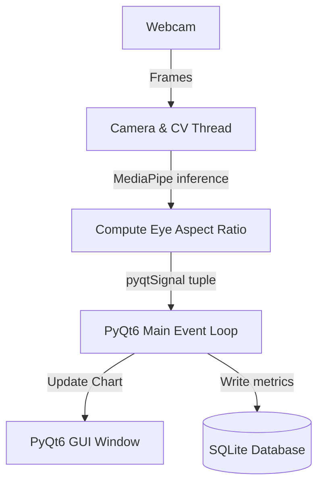

# Study Prep Guide: Blink

Welcome! This guide is a step-by-step tutorial designed to help beginners build **Blink**—a privacy-first desktop application that tracks eye fatigue using webcams. You will learn about desktop GUI development, multithreading, computer vision, and real-time facial landmark tracking.

---

## 🗺️ System Architecture

Blink relies on a robust multithreaded architecture. In GUI applications, doing heavy computations on the main thread freezes the interface. Thus, we separate concerns:


---

## 📚 Core Learning Prerequisites

Make sure you understand:
1. **PyQt6 Basics**: Windows, layouts, widgets, and the main event loop.
2. **Signals & Slots**: How components communicate asynchronously in Qt.
3. **OpenCV (`cv2`)**: Acquiring frames from webcams and converting color channels.
4. **Facial Landmarks & EAR (Eye Aspect Ratio)**: MediaPipe tracks coordinates. By measuring eyelid distances relative to eye width, we calculate if the eye is open or shut.

---

## 🛠️ Step-by-Step Implementation Guide

Let's build a simplified command-line facial EAR calculator using OpenCV and MediaPipe.

### Step 1: Set Up the Environment
Create a folder and install the required modules:
```bash
mkdir mini-blink
cd mini-blink
python -m venv venv
venv\Scripts\activate  # On Windows
pip install opencv-python mediapipe numpy
```

---

### Step 2: Extract Eye Aspect Ratio (EAR)
Create a Python script called `ear_calculator.py`. We will calculate the EAR for a single eye given 6 coordinate points:

```python
import numpy as np

def calculate_ear(eye_points):
    """
    eye_points: list of 6 points [(x, y), ...]
    Points:
    p1: left corner of eye
    p2, p3: upper eyelid points
    p4: right corner of eye
    p5, p6: lower eyelid points
    """
    p = np.array(eye_points)
    
    # Vertical distances
    d_v1 = np.linalg.norm(p[1] - p[5])  # p2 to p6
    d_v2 = np.linalg.norm(p[2] - p[4])  # p3 to p5
    
    # Horizontal distance
    d_h = np.linalg.norm(p[0] - p[3])   # p1 to p4
    
    # EAR formula
    ear = (d_v1 + d_v2) / (2.0 * d_h)
    return ear

# Mock coordinates (open eye)
open_eye = [(100, 100), (110, 90), (120, 90), (130, 100), (120, 110), (110, 110)]
print(f"Open Eye EAR: {calculate_ear(open_eye):.2f}")

# Mock coordinates (closed eye - vertical points collapse)
closed_eye = [(100, 100), (110, 100), (120, 100), (130, 100), (120, 100), (110, 100)]
print(f"Closed Eye EAR: {calculate_ear(closed_eye):.2f}")
```

Run the script:
```bash
python ear_calculator.py
```

---

### Step 3: Multithreaded PyQt6 Architecture
When integrating OpenCV and MediaPipe into a PyQt GUI, create a worker thread (`QThread`) that communicates with the main GUI via a custom `pyqtSignal`. Create `gui_example.py`:

```python
import sys
import cv2
from PyQt6.QtCore import QThread, pyqtSignal, pyqtSlot
from PyQt6.QtWidgets import QApplication, QLabel, QVBoxLayout, QWidget

class VideoThread(QThread):
    # Cross-thread signal carrying the raw frame
    frame_signal = pyqtSignal(object)

    def run(self):
        cap = cv2.VideoCapture(0)  # Open default camera
        while cap.isOpened():
            ret, frame = cap.read()
            if ret:
                self.frame_signal.emit(frame)
                self.msleep(33)  # Loop at ~30 FPS
            else:
                break
        cap.release()

class MainWindow(QWidget):
    def __init__(self):
        super().__init__()
        self.setWindowTitle("Blink Camera Feed")
        self.layout = QVBoxLayout()
        self.label = QLabel("Waiting for camera...")
        self.layout.addWidget(self.label)
        self.setLayout(self.layout)

        # Instantiate and start the camera thread
        self.thread = VideoThread()
        self.thread.frame_signal.connect(self.update_image)
        self.thread.start()

    @pyqtSlot(object)
    def update_image(self, frame):
        # In a real app, convert CV2 frame to QImage/QPixmap here.
        # For simplicity, we just print the resolution.
        h, w, c = frame.shape
        self.label.setText(f"Active Camera Resolution: {w}x{h}")

if __name__ == "__main__":
    app = QApplication(sys.argv)
    window = MainWindow()
    window.show()
    sys.exit(app.exec())
```

Run this file to see a responsive window that detects your webcam!

---

## 🔍 Key Deep Dive Topics

### 1. Adaptive EAR Calibration
People have different eye shapes, eyelid droops, and distances to the webcam. Hardcoding an EAR threshold (e.g., `0.2`) will result in false positives.
* **Calibration Phase**: During startup, the app collects the EAR for 7 seconds (approx. 210 frames), assuming the user is looking naturally at the screen. The threshold is then set at `80%` of the average open EAR.

### 2. Composite Fatigue Score (0-100)
A rolling buffer calculates eye fatigue over a 60-second window:
- **Low Blink Rate Penalty**: If your blink frequency drops below 12 bpm (blinks per minute), a penalty is applied.
- **Duration Penalty**: Squinting or keeping eyes closed longer than 150ms increases fatigue indices.
- **EAR Variance**: High variance signifies struggling to keep eyes open.

---

## 🎯 Verification Tasks

1. **Install and Run**: Run `INSTALL.bat` and then `Run_Project.bat` to launch the full PyQt6 application.
2. **Webcam Test**: Complete the 7-second calibration phase, then blink intentionally and check if the dashboard tracks your EAR values and increments the blink counter.
