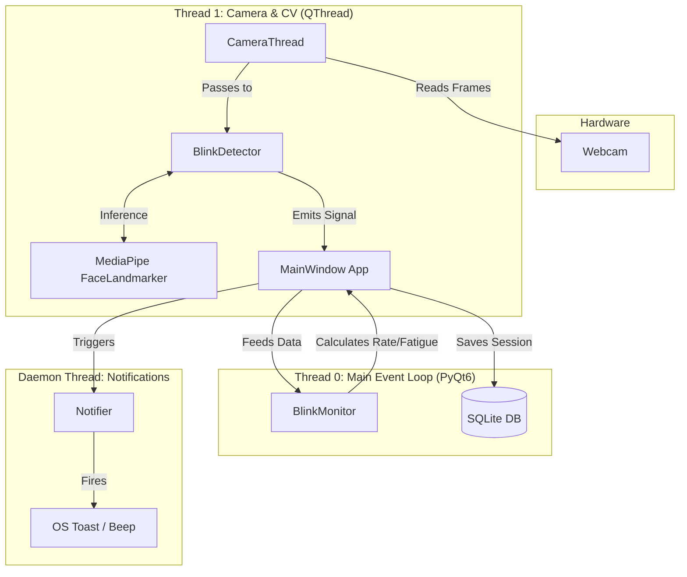

<div align="center">
  <h1>Blink </h1>
  <p><b>Advanced Eye Health Monitor & Fatigue Tracker</b></p>
  
  <a href="https://github.com/Ares19v/Blink/actions/workflows/ci.yml">
    
  </a>
  
  
  
  
</div>

---

**Blink** is a locally-processed, privacy-first desktop application engineered to monitor your blink rate via webcam and prevent digital eye strain. Utilizing advanced computer vision techniques (Google's MediaPipe), it tracks your Eye Aspect Ratio (EAR) in real-time and provides intelligent nudges when your eyes exhibit signs of fatigue.

Designed with a modern dark-themed GUI and built on a multithreaded architecture, Blink serves as both a practical health tool and a demonstration of production-ready Python development, featuring robust CI/CD, unit testing, and local data persistence.

---

## 📑 Table of Contents
- [✨ Core Features](#-core-features)
- [🏛️ System Architecture](#️-system-architecture)
- [🔬 The Science: How it Works](#-the-science-how-it-works)
- [💻 Technology Stack](#-technology-stack)
- [🚀 Quick Start (Windows)](#-quick-start-windows)
- [🛠️ Developer Setup](#️-developer-setup)
- [🐳 CI/CD & Docker](#-cicd--docker)
- [📄 License](#-license)

---

## ✨ Core Features

- **Adaptive EAR Calibration**: Human faces vary. Blink automatically measures your unique resting Eye Aspect Ratio during a 7-second startup phase to dynamically establish your baseline threshold.
- **Blink Duration Analysis**: Not all blinks are equal. The engine tracks blink duration in milliseconds, distinguishing between complete, refreshing blinks and rapid, partial (incomplete) blinks.
- **Composite Fatigue Score (0-100)**: A proprietary heuristic that calculates real-time eye fatigue by synthesizing three vectors: *Blink Rate (bpm)*, *Average Blink Duration*, and *EAR Variance*.
- **20-20-20 Rule Integration**: Built-in timers remind you to look 20 feet away for 20 seconds every 20 minutes, reinforced by a distinct double-beep audio cue.
- **Session Analytics & Persistence**: Every monitoring session is logged to a local SQLite database. The built-in dashboard uses Matplotlib to visualize your blink rate and fatigue trends over time.
- **Asynchronous Notifications**: Utilizes daemon threads to dispatch non-blocking OS-level toast notifications and audio alerts without stalling the video processing pipeline.
- **Privacy Guaranteed**: 100% of the processing happens on your local machine. No video feeds or biometrics are ever transmitted over the network.

---

## 🏛️ System Architecture

Blink is designed around a strictly separated, multithreaded architecture to ensure the PyQt6 GUI remains highly responsive while performing CPU-intensive computer vision inference at 30 FPS.



### Data Flow
1. `CameraThread` continuously polls `cv2.VideoCapture`.
2. Frames are passed to `BlinkDetector`, which utilizes the MediaPipe Tasks API.
3. A `pyqtSignal` safely transmits a 5-tuple payload `(frame, blink_bool, ear_float, face_bool, duration_ms)` across the thread boundary to the main GUI.
4. The GUI passes logical data to `BlinkMonitor` (a rolling-window state machine).
5. On exit, session statistics are serialized to `database.py` (SQLite).

---

## 🔬 The Science: How it Works

### Eye Aspect Ratio (EAR)
Instead of relying on heavy image classification models to determine if an eye is open or closed, Blink uses a geometric heuristic called the **Eye Aspect Ratio**, introduced by Soukupová and Čech (2016).

MediaPipe provides 468 3D face landmarks. We extract 6 specific points around each eye. The EAR is the ratio of the vertical distances between the eyelids to the horizontal distance between the eye corners:

$$EAR = \frac{||p_2 - p_6|| + ||p_3 - p_5||}{2 ||p_1 - p_4||}$$

When an eye closes, the vertical distances drop to near zero, causing the EAR to plummet. If the EAR drops below the user's **Calibrated Threshold** for 2 consecutive frames, a blink is registered.

### Fatigue Score Heuristic
The `BlinkMonitor` maintains a 60-second rolling buffer (`collections.deque`). The Fatigue Score is a weighted calculation:
*   **40% Blink Rate Penalty**: (Optimal > 12 bpm)
*   **40% Duration Penalty**: (Optimal > 100ms)
*   **20% EAR Variance Penalty**: (High variance indicates squinting or heavy eyelids)

---

## 💻 Technology Stack

| Component | Technology | Purpose |
| :--- | :--- | :--- |
| **Language** | Python 3.11 | Core logic |
| **Computer Vision** | OpenCV (`cv2`) | Video capture and frame manipulation |
| **Machine Learning** | Google MediaPipe | High-performance face landmark detection |
| **GUI Framework** | PyQt6 | Desktop interface, threading (`QThread`), and signals |
| **Data Visualization** | Matplotlib | Rendering historical session data graphs |
| **Persistence** | SQLite | Storing session metrics locally |
| **Testing** | Pytest | Decoupled unit testing for mathematical/logic layers |
| **CI/CD & Code Quality** | GitHub Actions, Flake8, Black | Automated linting, formatting, and headless testing |

---

## 🚀 Quick Start (Windows)

For standard users, we provide automated batch scripts for seamless setup and execution.

1. **Clone the repository**:
   ```cmd
   git clone https://github.com/Ares19v/Blink.git
   cd Blink
   ```
2. **Install**: Double-click `INSTALL.bat`. This automatically sets up the Python environment, installs dependencies, and drops a shortcut on your Desktop.
3. **Run**: Double-click the new `Blink` desktop shortcut, or run `Run_Project.bat`.
4. **Uninstall**: Double-click `UNINSTALL.bat` to safely remove logs, config files, and the SQLite database.

---

## 🛠️ Developer Setup

If you wish to contribute or modify the application:

```bash
# 1. Create a virtual environment
python -m venv venv
source venv/bin/activate  # Or venv\Scripts\activate on Windows

# 2. Install dependencies
pip install -r requirements.txt

# 3. Run the unit tests
pytest tests/ -v

# 4. Start the application
python main.py
```

### Building the Executable
To compile Blink into a standalone `.exe` without requiring users to install Python:
```cmd
build.bat
```
The executable will be generated inside the `dist/` directory.

---

## 🐳 CI/CD & Docker

Because Blink relies heavily on local hardware (Webcam) and OS-level window management (PyQt6), running the *application* inside Docker is not practical or intended for end-users. 

However, we utilize Docker for **Headless CI/CD Testing**. The included `Dockerfile` and `docker-compose.yml` simulate an X11 display server using `xvfb`.

To run the automated tests in an isolated container exactly as GitHub Actions does:
```bash
docker-compose up --build
```

---

## 📄 License
This project is licensed under the MIT License. See the [LICENSE](LICENSE) file for details.
