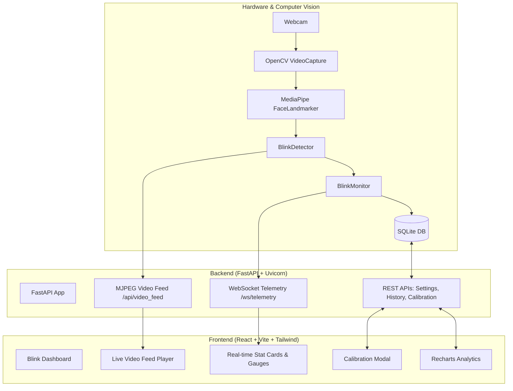

<div align="center">
  <h1>Blink 👁️</h1>
  <p><b>Advanced Eye Health Monitor & Fatigue Tracker</b></p>
  
  <a href="https://github.com/Ares19v/Blink/actions/workflows/ci.yml">
    
  </a>
  
  
  
  
  
  
</div>

---

**Blink** is a locally-processed, privacy-first web & desktop application engineered to monitor your blink rate via webcam and prevent digital eye strain. Utilizing Google's MediaPipe FaceLandmarker, it tracks your Eye Aspect Ratio (EAR) in real-time, analyzes fatigue levels, and provides intelligent nudges when your eyes exhibit signs of strain.

Re-architected with a high-performance **FastAPI + Uvicorn** backend and a cyberpunk dark-themed **React + Vite** frontend.

---

## 📑 Table of Contents
- [✨ Core Features](#-core-features)
- [🏛️ System Architecture](#️-system-architecture)
- [🔬 The Science: How it Works](#-the-science-how-it-works)
- [💻 Technology Stack](#-technology-stack)
- [🚀 Quick Start (Windows)](#-quick-start-windows)
- [🛠️ Developer Setup](#️-developer-setup)
- [📄 License](#-license)

---

## ✨ Core Features

- **Adaptive EAR Calibration**: Human faces vary. Blink automatically measures your unique resting Eye Aspect Ratio during a 7-second startup phase to dynamically establish your baseline threshold.
- **Blink Duration Analysis**: The engine tracks blink duration in milliseconds, distinguishing between complete, refreshing blinks and rapid, partial (incomplete) blinks.
- **Composite Fatigue Score (0-100)**: A proprietary heuristic that calculates real-time eye fatigue by synthesizing three vectors: *Blink Rate (bpm)*, *Average Blink Duration*, and *EAR Variance*.
- **20-20-20 Rule Integration**: Built-in timers remind you to look 20 feet away for 20 seconds every 20 minutes, reinforced by audio and toast cues.
- **Session Analytics & Persistence**: Every monitoring session is logged to a local SQLite database with interactive trend charts powered by Recharts.
- **Fast MJPEG Video Streaming**: Sub-50ms latency webcam video stream with facial landmark overlays and HUD metrics.
- **High-Frequency WebSocket Telemetry**: Real-time biometric streaming at 10Hz.
- **Privacy Guaranteed**: 100% of the processing happens on your local machine. No video feeds or biometrics are ever transmitted over the network.

---

## 🏛️ System Architecture


```mermaid
graph TD
    subgraph "Hardware & Computer Vision"
        WC[Webcam] --> CV[OpenCV VideoCapture]
        CV --> MP[MediaPipe FaceLandmarker]
        MP --> BD[BlinkDetector]
        BD --> BM[BlinkMonitor]
        BM --> DB[(SQLite DB)]
    end

    subgraph "Backend (FastAPI + Uvicorn)"
        SRV[FastAPI App]
        MJPEG[MJPEG Video Feed /api/video_feed]
        WS[WebSocket Telemetry /ws/telemetry]
        REST[REST APIs: Settings, History, Calibration]
        
        BD --> MJPEG
        BM --> WS
        DB <--> REST
    end

    subgraph "Frontend (React + Vite + Tailwind)"
        UI[Blink Dashboard]
        VID[Live Video Feed Player]
        STATS[Real-time Stat Cards & Gauges]
        CALIB[Calibration Modal]
        HIST[Recharts Analytics]
        
        MJPEG --> VID
        WS --> STATS
        REST <--> CALIB
        REST <--> HIST
    end
```

---

## 💻 Technology Stack

| Component | Technology | Purpose |
| :--- | :--- | :--- |
| **Backend Framework** | FastAPI & Uvicorn | Async REST APIs and WebSocket server |
| **Frontend Framework** | React 19 + TypeScript | Interactive single page application |
| **Frontend Build Tool** | Vite 6 | Ultra-fast bundling & development |
| **Styling** | Tailwind CSS v4 | Dark Cyberpunk UI design system |
| **Computer Vision** | OpenCV (`cv2`) | Video capture and image processing |
| **Machine Learning** | Google MediaPipe | Real-time face landmark mesh |
| **Data Visualization** | Recharts | Interactive blink rate and fatigue graphs |
| **Persistence** | SQLite | Local session persistence |
| **Testing** | Pytest & TestClient | Unit and integration test suite |

---

## 🚀 Quick Start (Windows)

1. **Run the Project**:
   ```cmd
   Run_Project.bat
   ```
   This automatically verifies dependencies, starts the FastAPI server on `http://127.0.0.1:8000`, and opens your browser.

---

## 🛠️ Developer Setup

### 1. Backend (FastAPI + Python)
```bash
# Install Python packages
pip install -r requirements.txt

# Run pytest test suite
pytest tests/ -v

# Start FastAPI server
python server.py
```

### 2. Frontend (React + Vite)
```bash
cd frontend

# Install npm packages
npm install

# Start Vite dev server with Hot Module Replacement
npm run dev

# Build for production
npm run build
```

---

© 2026 Devansh Tyagi (Ares19v). All Rights Reserved.
